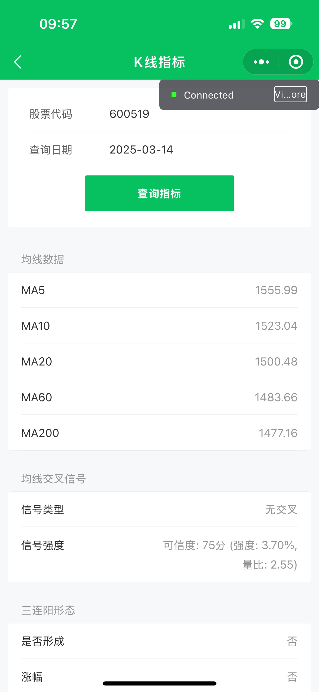

# Stock Analysis Platform

[](https://www.python.org/)
[](https://flask.palletsprojects.com/)
[](https://www.mysql.com/)
[](https://opensource.org/licenses/MIT)

一个功能强大的A股分析平台，集成了多种投资策略、技术分析和 AI 辅助决策功能。支持实时数据分析、多维度技术指标计算、智能选股和投资建议等功能。

## 功能特点

### 1. 技术分析功能
- 均线分析（MA5/10/20/60）
- MACD 指标分析
- RSI 超买超卖
- 量价关系分析
- 趋势识别
- 形态识别

### 2. AI 辅助决策
- 智能行情分析
- 风险评估
- 投资建议生成
- 市场情绪分析

### 3. 数据管理
- 历史数据采集
- 实时数据更新
- 数据清洗处理
- 数据备份恢复

### 4. 微信小程序前端
- 行情实时展示
- 个股详细信息
- 技术指标图表
- AI分析报告
- 自选股管理
- 用户偏好设置


## 系统架构

```
backend/
├── apis/                 # API 接口模块
│   ├── technical_api.py      # 技术分析接口
│   ├── stock_details_api.py  # 股票详情接口
│   ├── stock_ai_analysis_api.py  # AI 分析接口
│   ├── stock_history_api.py  # 历史数据接口
│   └── ...
├── config/              # 配置文件
│   ├── database.py     # 数据库配置
│   └── config.py       # 应用配置
├── stock_history/      # 历史数据模块
│   ├── downloader/     # 数据下载器
│   └── db/            # 数据库操作
└── scripts/           # 工具脚本
    ├── create_tables.sql  # 建表脚本
    └── clean_data.sql    # 数据清理脚本

miniprogram/ # 微信小程序前端
├── pages/ # 页面组件
├── components/ # 通用组件
└── utils/ # 工具函数
```

## 快速开始

### 1. 环境要求
- Python 3.8+
- MySQL 8.0+
- 操作系统：Linux/macOS/Windows
- [微信开发者工具]https://developers.weixin.qq.com/miniprogram/dev/devtools/download.html

### 2. 安装步骤

1. 克隆项目
```bash
git clone https://github.com/qchenzi/stockAna.git
cd stockAna
```

2. 创建虚拟环境
```bash
python3 -m venv venv
source venv/bin/activate  # Linux/macOS
# 或
.\venv\Scripts\activate  # Windows
```

3. 安装依赖
```bash
pip install -r requirements.txt
```

4. 配置数据库
```bash
# 1. 创建数据库
mysql -u root -p
CREATE DATABASE stock_analysis;

# 2. 创建用户并授权
CREATE USER 'stock_app'@'localhost' IDENTIFIED BY 'yourpasswd';
GRANT SELECT, INSERT, UPDATE, DELETE ON stock_analysis.* TO 'stock_app'@'localhost';

CREATE USER 'stock_reader'@'localhost' IDENTIFIED BY 'yourpasswd';
GRANT SELECT ON stock_analysis.* TO 'stock_reader'@'localhost';

CREATE USER 'stock_admin'@'localhost' IDENTIFIED BY 'yourpasswd';
GRANT SELECT, INSERT, UPDATE, DELETE ON stock_analysis.* TO 'stock_admin'@'localhost';

# 3. 执行建表脚本
mysql -u root -p stock_analysis < backend/scripts/create_tables.sql
```

5. 配置应用
```bash

# 修改配置文件
vim backend/config/config.py
vim backend/config/database.py
```

### 3. 启动后端服务

```bash
# 开发环境
python backend/http_stock_server.py --port 5000

# 生产环境（使用 gunicorn）
gunicorn -w 4 -b 0.0.0.0:5000 backend.http_stock_server:app
```

### 4. 配置微信开发者工具

1. 下载并安装[微信开发者工具](https://developers.weixin.qq.com/miniprogram/dev/devtools/download.html)

2. 导入项目
   - 打开微信开发者工具
   - 点击"项目 - 导入项目"

3. 开发调试
   - 确保后端服务已启动
   - 在开发者工具中预览和调试小程序
   - 修改 `miniprogram/app.js` 中的接口地址为本地服务地址

### 5. 部分演示图

#### 1. 每日推荐

每日智能推荐功能展示了基于多维度分析的股票推荐列表，包含技术面、基本面和 AI 分析的综合评分。

#### 2. 个股详情

展示个股的详细信息，包括基本信息、实时行情、技术指标、财务数据等多维度数据。

#### 3. 股票列表

支持多种筛选和排序的股票列表，帮助用户快速找到感兴趣的股票。

#### 4. k线分析

提供专业的技术分析工具，包括均线、MACD、RSI 等技术指标，以及形态识别和趋势分析。

#### 5. AI分析

基于深度学习模型的智能分析系统，可以对股票走势进行预测，并提供买卖点建议和风险提示。

#### 6. 筹码选股

通过对股票筹码分布的分析，帮助投资者了解主力资金动向和持仓成本，发现潜在的投资机会。


## 数据管理指南

### 1. 使用管理员命令行工具

项目提供了一个交互式命令行工具 `admin_cli.py` 来管理数据，进行基本面数据和历史交易数据的下载/导入/分析：

```bash
python backend/admin_cli.py
```

这个工具提供以下功能：

#### 1.1 股票基本面数据管理
- 数据采集：获取股票列表和下载股票数据
- 数据分析：处理最新/历史/指定日期数据
- 数据入库：导入最新/历史/指定日期数据
- 数据清理：清理指定日期或所有数据
- 系统维护：查看错误日志等

#### 1.2 历史交易数据管理
- 数据下载：
  ```bash
  # 下载指定日期范围的数据
  python -m stock_history.downloader.ak_downloader -o data/custom_period -s stock_list.csv --start-date 2025-01-01 --end-date 2025-03-20 --workers 3

  # 下载最新数据
  python -m stock_history.downloader.ak_downloader -o data/latest -s stock_list.csv --workers 3
  ```

- 数据入库：
  ```bash
  # 导入所有数据
  python -m stock_history.db.history_db import --data-dir data/latest --mode all --workers 5

  # 导入指定日期范围的数据
  python -m stock_history.db.history_db import --data-dir data/custom_period --mode date_range --start-date 2025-01-01 --end-date 2025-03-20 --workers 5
  ```

- 数据删除：
  ```bash
  # 删除指定股票的数据
  python -m stock_history.db.history_db delete --stock-code 600519 --start-date 2025-01-01 --end-date 2025-03-20

  # 删除所有股票在指定日期范围的数据
  python -m stock_history.db.history_db delete --start-date 2025-01-01 --end-date 2025-03-20
  ```

### 2. 数据分析功能

#### 2.1 筹码分析
```bash
# 更新今日筹码分析
python scripts/stock_chip_analyzer.py
```

#### 2.2 技术评分
```bash
# 更新今日技术评分，导入每日推荐
python scripts/stock_technical_scorer.py
```

### 3. 数据维护建议

1. 定期数据更新
   - 每个交易日收盘后更新当日数据
   - 周末进行历史数据的完整性检查
   - 定期清理过期数据节省存储空间

2. 数据备份策略
   - 自行每日增量备份交易数据
   - 自行每周进行一次全量备份

3. 错误处理
   - 对失败的数据下载任务进行重试
   - 保持数据的一致性和完整性

4. 性能优化
   - 根据服务器配置调整并发数
   - 对频繁访问的数据建立索引
   - 定期优化数据库表

### 4. 注意事项

1. 数据采集
   - 避免频繁请求以防被封 IP
   - 建议使用代理池轮换 IP
   - 遵守数据源的使用协议

2. 数据清理
   - 清理数据前先进行备份
   - 使用事务确保数据一致性
   - 避免在交易时段进行大规模数据操作

3. 系统维护
   - 定期检查磁盘空间
   - 监控数据库连接数
   - 及时处理错误日志

## 开发指南

### 1. 添加新策略

1. 在 `backend/apis` 目录下创建新的策略文件
2. 实现策略逻辑
3. 在 `http_stock_server.py` 中注册新的蓝图
4. 更新策略说明文档

### 2. 自定义评分规则

1. 修改 `stock_strategy_api.py` 中的评分规则
2. 添加新的评分指标
3. 调整权重配置
4. 更新评分说明文档

### 3. 数据采集配置

1. 配置数据源
2. 设置采集频率
3. 配置数据清洗规则
4. 设置数据备份策略

## 常见问题

### 1. 数据采集失败（yfinance拉取基本面数据需要科学上网）
- 检查网络连接
- 确认股票代码格式
- 检查 API 限制
- 查看错误日志

### 2. 评分异常
- 检查数据完整性
- 确认计算周期
- 验证指标数据
- 调整评分权重

### 3. 服务启动失败
- 检查端口占用
- 确认配置文件
- 验证数据库连接
- 查看错误日志

## 贡献指南

1. Fork 项目
2. 创建特性分支 (`git checkout -b feature/AmazingFeature`)
3. 提交更改 (`git commit -m 'Add some AmazingFeature'`)
4. 推送到分支 (`git push origin feature/AmazingFeature`)
5. 提交 Pull Request

## 版本历史

- v1.0.0 (2025-03-20)
  - 初始版本发布
  - 支持基础策略分析
  - 实现技术指标计算
  - 集成 AI 分析功能

## 许可证

本项目采用 MIT 许可证 - 详见 [LICENSE](LICENSE) 文件